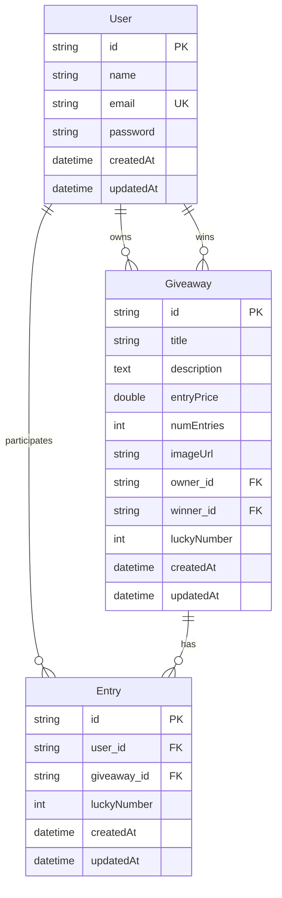

# 🍀 sorte.io

**sorte.io** é uma plataforma moderna e intuitiva para criação e participação em sorteios e rifas online. Representada pelo ícone de um **trevo de quatro folhas**, a aplicação oferece uma experiência divertida, confiável e acessível para quem quer testar a sorte — seja organizando ou participando de rifas digitais.

---

## 📚 Sobre o Projeto

Este projeto foi desenvolvido como parte da disciplina de **Desenvolvimento Web** do curso de Engenharia na **Universidade Federal Fluminense (UFF)**.

---

## 🛠️ Tecnologias Utilizadas

### Frontend (sorteio-web)

-   **[React](https://reactjs.org/)** - Biblioteca JavaScript para construção de interfaces
-   **[TypeScript](https://www.typescriptlang.org/)** - Superset do JavaScript com tipagem estática
-   **[Vite](https://vitejs.dev/)** - Ferramenta de build rápida e moderna
-   **[React Router DOM](https://reactrouter.com/)** - Navegação entre páginas
-   **[React Query (@tanstack/react-query)](https://tanstack.com/query/latest)** - Gerenciamento de estado assíncrono
-   **[Bootstrap](https://getbootstrap.com/)** - Framework CSS para design responsivo
-   **[Zustand](https://github.com/pmndrs/zustand)** - Gerenciamento de estado global
-   **[Zod](https://zod.dev/)** - Validação de schemas TypeScript-first
-   **[js-cookie](https://github.com/js-cookie/js-cookie)** - Manipulação de cookies

### Backend (sorteio-api)

-   **[Java 21](https://openjdk.org/projects/jdk/21/)** - Linguagem de programação
-   **[Spring Boot 3.4.4](https://spring.io/projects/spring-boot)** - Framework Java
-   **[Spring Data JPA](https://spring.io/projects/spring-data-jpa)** - Abstração para persistência de dados
-   **[Hibernate 6.5.3](https://hibernate.org/)** - ORM (Object-Relational Mapping)
-   **[MySQL](https://www.mysql.com/)** - Sistema de gerenciamento de banco de dados
-   **[HikariCP](https://github.com/brettwooldridge/HikariCP)** - Pool de conexões
-   **[Lombok](https://projectlombok.org/)** - Redução de código boilerplate
-   **[Bean Validation](https://beanvalidation.org/)** - Validação de dados
-   **[JWT (JSON Web Tokens)](https://jwt.io/)** - Autenticação e autorização

---

## 🎯 Funcionalidades

### 👤 Autenticação e Usuários

-   ✅ **Cadastro de usuários** com validação de dados
-   ✅ **Login/Logout** com persistência de sessão
-   ✅ **Perfil do usuário** com estatísticas pessoais
-   ✅ **Rotas protegidas** para usuários autenticados

### 🎲 Sorteios

-   ✅ **Criação de sorteios** com:
    -   Título, descrição e imagem
    -   Definição da quantidade de entradas
    -   Definição do valor por entrada
-   ✅ **Listagem paginada** de sorteios ativos
-   ✅ **Visualização detalhada** de cada sorteio
-   ✅ **Busca por título** de sorteios
-   ✅ **Edição e exclusão** de sorteios pelo proprietário
-   ✅ **Sorteio automático** de vencedores
-   ✅ **Listagem de sorteios finalizados** com vencedores

### 🛒 Sistema de Compras

-   ✅ **Carrinho de compras** com:
    -   Adição/remoção de entradas
    -   Controle de quantidade
    -   Cálculo automático de totais
-   ✅ **Compra de entradas** em múltiplos sorteios
-   ✅ **Validação de disponibilidade** de entradas
-   ✅ **Feedback visual** de compras realizadas

### ⭐ Funcionalidades Extras

-   ✅ **Sistema de favoritos** para marcar sorteios
-   ✅ **Scroll infinito** na listagem de sorteios
-   ✅ **Interface responsiva** com tema escuro
-   ✅ **Validação de formulários** em tempo real
-   ✅ **Tratamento de erros** com mensagens amigáveis
-   ✅ **Gerenciamento de sorteios** pelo proprietário

---

## 🏗️ Arquitetura do Projeto

O projeto segue uma arquitetura **cliente-servidor** com separação clara entre frontend e backend:

### � Estrutura de Pastas

```
sorte.io/
├── sorteio-api/          # Backend (Spring Boot)
│   ├── src/main/java/com/sorte/io/apirestful/
│   │   ├── controller/   # Controladores REST
│   │   ├── service/      # Lógica de negócio
│   │   ├── repository/   # Camada de dados
│   │   ├── model/        # Entidades JPA
│   │   ├── dto/          # Objetos de transferência
│   │   └── exception/    # Tratamento de exceções
│   └── src/main/resources/
│       └── application.properties
├── sorteio-web/          # Frontend (React + TypeScript)
│   ├── src/
│   │   ├── components/   # Componentes reutilizáveis
│   │   ├── pages/        # Páginas da aplicação
│   │   ├── hooks/        # Custom hooks
│   │   ├── interfaces/   # Tipos TypeScript
│   │   ├── routes/       # Configuração de rotas
│   │   ├── schemas/      # Validação com Zod
│   │   ├── stores/       # Estados globais (Zustand)
│   │   ├── utils/        # Funções utilitárias
│   │   └── lib/          # Bibliotecas customizadas
│   ├── public/           # Arquivos estáticos
│   └── package.json
└── README.md
```

### 🔄 Fluxo de Dados

1. **Frontend** faz requisições HTTP para o **Backend**
2. **Backend** processa as requisições e interage com o **Banco de Dados**
3. **Backend** retorna respostas JSON para o **Frontend**
4. **Frontend** atualiza a interface com os dados recebidos

### 🔗 Endpoints da API

#### 🔐 Autenticação

-   `POST /auth` - Login de usuário

#### 👤 Usuários

-   `POST /users/new` - Criar novo usuário
-   `GET /users/find?id={id}` - Buscar usuário por ID

#### 🎲 Sorteios

-   `GET /giveaways` - Listar todos os sorteios
-   `GET /giveaways/find?id={id}` - Buscar sorteio por ID
-   `GET /giveaways/find-active` - Listar sorteios ativos (paginado)
-   `GET /giveaways/find-ended` - Listar sorteios finalizados
-   `GET /giveaways/search?title={title}` - Buscar sorteios por título
-   `POST /giveaways` - Criar novo sorteio
-   `PUT /giveaways` - Atualizar sorteio
-   `DELETE /giveaways?id={id}` - Deletar sorteio
-   `POST /giveaways/join` - Participar de sorteios
-   `PUT /giveaways/draw?id={id}` - Sortear vencedor

---

## 📦 Como rodar o projeto localmente

### Pré-requisitos

-   **Node.js** v18+
-   **Java** 21+
-   **MySQL** 8.0+
-   **Maven** 3.6+

---

### 1. Clone o repositório

```bash
git clone https://github.com/gabrielbrev/sorte.io.git
cd sorte.io
```

---

### 2. Configure o banco de dados

Crie um banco MySQL chamado `sorteio` e configure as credenciais:

```sql
CREATE DATABASE sorteio;
```

Edite o arquivo `sorteio-api/src/main/resources/application.properties`:

```properties
spring.datasource.url=jdbc:mysql://localhost:3306/sorteio
spring.datasource.username=SEU_USUARIO
spring.datasource.password=SUA_SENHA
spring.datasource.driver-class-name=com.mysql.cj.jdbc.Driver

spring.jpa.hibernate.ddl-auto=create
spring.jpa.show-sql=false
server.port=8090
```

---

### 3. Inicialize o Backend

```bash
cd sorteio-api
./mvnw spring-boot:run
```

Ou no Windows:

```bash
mvnw.cmd spring-boot:run
```

A API estará disponível em `http://localhost:8090`

---

### 4. Inicialize o Frontend

```bash
cd sorteio-web
npm install
npm run dev
```

A aplicação estará disponível em `http://localhost:5173`

---

## 📊 Banco de Dados

### Modelo de Entidades



### Relacionamentos

-   **User** pode criar múltiplos **Giveaways** (proprietário)
-   **User** pode ganhar múltiplos **Giveaways** (vencedor)
-   **User** pode ter múltiplas **Entries** (participações)
-   **Giveaway** pode ter múltiplas **Entries** (entradas vendidas)

---

## 🔧 Comandos Úteis

### Backend (Maven)

```bash
# Compilar o projeto
./mvnw compile

# Rodar testes
./mvnw test

# Gerar JAR
./mvnw package

# Limpar build
./mvnw clean
```

### Frontend (npm)

```bash
# Instalar dependências
npm install

# Rodar em desenvolvimento
npm run dev

# Build para produção
npm run build

# Preview do build
npm run preview

# Linting
npm run lint
```

---

## 🎨 Principais Componentes

### Frontend

#### Páginas

-   **Home** - Listagem de sorteios ativos com scroll infinito
-   **Giveaway** - Visualização detalhada de um sorteio
-   **Profile** - Perfil do usuário com estatísticas
-   **CreateGiveaway** - Formulário para criar sorteios
-   **ManageGiveaway** - Gerenciamento de sorteios próprios
-   **ShoppingCart** - Carrinho de compras
-   **Favorites** - Lista de sorteios favoritos
-   **Login/Register** - Autenticação
-   **Winners** - Lista de vencedores

#### Componentes

-   **NavBar** - Navegação principal com carrinho
-   **GiveawayCard** - Card de visualização de sorteio
-   **PrivateRoutes** - Proteção de rotas autenticadas

#### Hooks Customizados

-   **useCart** - Gerenciamento do carrinho
-   **useFavorites** - Gerenciamento de favoritos
-   **useFormValidation** - Validação de formulários
-   **useLogin/useRegister** - Autenticação
-   **useCreateGiveaway** - Criação de sorteios
-   **useFindActiveGiveaways** - Listagem paginada
-   **useJoinGiveaway** - Participação em sorteios

### Backend

#### Controladores

-   **AuthController** - Autenticação
-   **UserController** - Gerenciamento de usuários
-   **GiveawayController** - Gerenciamento de sorteios

#### Serviços

-   **AuthService** - Lógica de autenticação
-   **UserService** - Lógica de usuários
-   **GiveawayService** - Lógica de sorteios

#### Repositories

-   **UserRepository** - Acesso a dados de usuários
-   **GiveawayRepository** - Acesso a dados de sorteios
-   **EntryRepository** - Acesso a dados de entradas

---

## 🚀 Próximos Passos

### Melhorias Planejadas

-   [ ] Sistema de notificações em tempo real
-   [ ] Sistema de pagamentos (PIX, cartão)
-   [ ] Dashboard administrativo
-   [ ] Relatórios e analytics
-   [ ] Sistema de avaliações
-   [ ] Integração com redes sociais
-   [ ] Aplicativo mobile (React Native)
-   [ ] Sistema de chat entre usuários

### Melhorias Técnicas

-   [ ] Implementar cache Redis
-   [ ] Adicionar testes unitários e integração
-   [ ] Configurar CI/CD
-   [ ] Dockerização da aplicação
-   [ ] Monitoramento e logs
-   [ ] Documentação da API (Swagger)
-   [ ] Implementar rate limiting
-   [ ] Otimização de performance

---

## 🤝 Contribuição

1. Faça o fork do projeto
2. Crie uma branch para sua feature (`git checkout -b feature/AmazingFeature`)
3. Commit suas mudanças (`git commit -m 'Add some AmazingFeature'`)
4. Push para a branch (`git push origin feature/AmazingFeature`)
5. Abra um Pull Request

---

## 📄 Licença

Este projeto foi desenvolvido para fins educacionais como parte da disciplina de Desenvolvimento Web da UFF.

---

## 👨‍💻 Desenvolvedor

**Gabriel Brevilieri**

-   GitHub: [@gabrielbrev](https://github.com/gabrielbrev)
-   Universidade Federal Fluminense (UFF)
-   Disciplina: Desenvolvimento Web

---

**Desenvolvido com ❤️ por Gabriel Brevilieri na UFF**

## 📄 Licença

Este projeto está licenciado sob a **MIT License** – veja o arquivo [LICENSE](LICENSE) para mais detalhes.

---

## 👤 Autor

Desenvolvido por [Gabriel Brevilieri](https://github.com/gabrielbrev)
